# MediChain AI 🏥⛓️

> **AI-powered, blockchain-secured decentralized healthcare intelligence platform.**

🏆 **HackaLeague Track:** Digital, Economic & Information Systems

Upload medical reports, receive instant AI diagnostics with risk scores, chat with an AI health assistant, watch personalized AI doctor video explanations — all with patient-controlled, on-chain access management and zero-knowledge encryption.

---

## 🖼️ Website Overview

### Landing Page

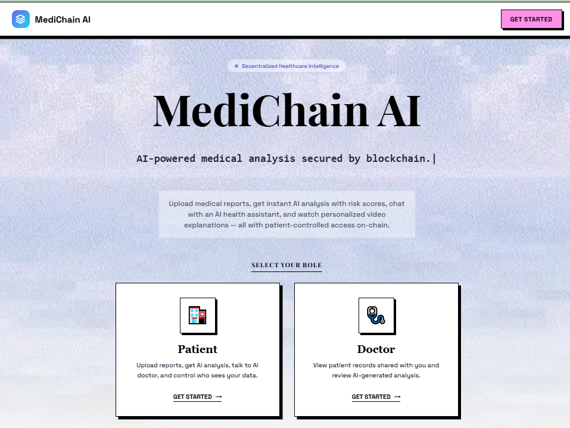

The landing page is the entry point of **MediChain AI**. Here's what each part does:

| Section | Description |
|---------|-------------|
| **Navbar** | Top bar with the MediChain AI logo and a pink **GET STARTED** button that jumps users to the role selector. |
| **Hero Badge** | A small pill badge reading *"Decentralized Healthcare Intelligence"* to communicate the core value proposition at a glance. |
| **Hero Headline** | Bold `MediChain AI` title with the animated tagline *"Instant AI diagnostics from your reports."* — typed letter-by-letter for a dynamic feel. |
| **Hero Description** | A brief paragraph explaining the four core features: report upload, AI analysis, AI chat, and AI video — all secured on-chain. |
| **SELECT YOUR ROLE** | Two cards that let users choose their journey: **Patient** or **Doctor**. |
| **Patient Card** | Leads to the Patient Dashboard where users can upload reports, get AI analysis, talk to AI, and control data access. |
| **Doctor Card** | Leads to the Doctor Dashboard where doctors can view patient records shared with them and review AI-generated analysis. |

---

## 🔐 Patient Registration (Blockchain)

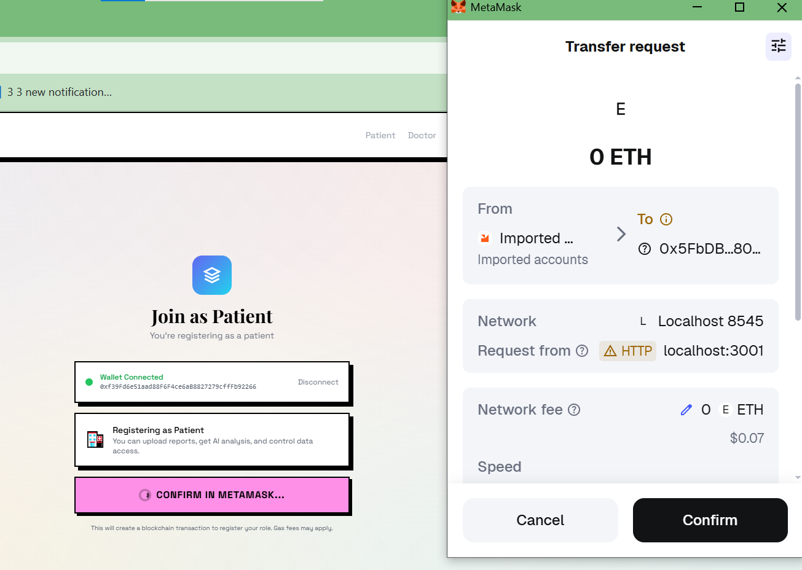

When a user selects **Patient** on the landing page, they are taken to the registration screen where their identity is anchored on-chain via MetaMask. Here's every element explained:

### Left Panel — Registration Form

| Element | Description |
|---------|-------------|
| **MediChain AI Icon** | Blue layered logo icon confirming you're in the MediChain ecosystem |
| **"Join as Patient" Heading** | Confirms the role being registered — *Patient* |
| **Subtitle** | *"You're registering as a patient"* — clear context for the user |
| **Wallet Connected (green dot)** | Shows the MetaMask wallet is successfully connected. Displays the truncated wallet address (`0xf39Fd6e5...2266`) with a **Disconnect** button to switch accounts |
| **"Registering as Patient" Info Box** | Describes what patient access unlocks: *"You can upload reports, get AI analysis, and control data access."* — sets expectations before confirming |
| **CONFIRM IN METAMASK Button** | A prominent pink button that triggers the on-chain `registerPatient()` transaction. Clicking this opens the MetaMask popup |
| **Gas Fee Warning** | Small text below: *"This will create a blockchain transaction to register your role. Gas fees may apply."* — transparent about cost |

### Right Panel — MetaMask Transaction Popup

| Element | Description |
|---------|-------------|
| **"Transfer request" Header** | MetaMask's label for the triggered smart contract call |
| **0 ETH** | Confirms this is a **zero-value transaction** — no ETH is being transferred, only the registration function is called |
| **From → To** | Shows the patient's imported wallet sending to the smart contract address (`0x5FbDB...80...`) |
| **Network: Localhost 8545** | The Hardhat local blockchain network — for demo/testing purposes |
| **Request from: localhost:3001** | The frontend app (Next.js dev server) that initiated the transaction request |
| **Network fee: ~0 ETH / $0.07** | The gas cost is minimal — just enough to write the registration to the blockchain |
| **Speed** | Transaction speed selector (configurable) |
| **Cancel / Confirm Buttons** | User can cancel or confirm the blockchain registration — clicking **Confirm** calls `registerPatient()` on `MediChainRecords.sol` and redirects to the Patient Dashboard |

> **Why blockchain registration?** Storing roles on-chain ensures that only verified, wallet-authenticated patients and doctors can interact with sensitive medical data. No central authority can modify or revoke roles without the user's private key.

---

## 🧑‍⚕️ Patient Dashboard


The Patient Dashboard is the core interface for patients. It is organized into several tabs/views:

### 📊 Analysis Tab

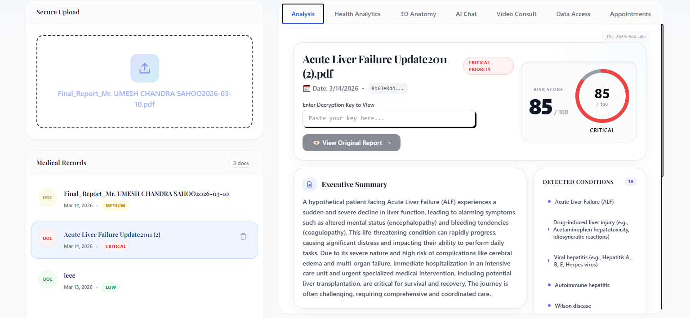

The **Analysis** tab is the first and primary view when a patient opens their dashboard. It shows the full AI-generated report breakdown for the uploaded medical file.

#### Navigation Bar (Tab Switcher)
At the top of the dashboard, a horizontal tab bar lets patients switch between all features:

| Tab | Purpose |
|-----|---------|
| **Analysis** *(active)* | AI report summary, risk score, recommendations |
| **Health Analytics** | Trend charts and health metrics over time |
| **3D Anatomy** | Interactive 3D body viewer to explore affected regions |
| **AI Chat** | Chat with an AI health assistant |
| **Video Consult** | AI doctor avatar video explanation |
| **Data Access** | Grant/Revoke blockchain-based doctor access |
| **Appointments** | View and manage booked appointments |

#### Report Header Card

| Element | Description |
|---------|-------------|
| **Filename** | `hearth issue.pdf` — the original uploaded report name |
| **CRITICAL PRIORITY Badge** | Red badge automatically assigned based on the AI risk score — alerts patient of urgency |
| **Date** | `2/22/2026` — date the report was uploaded and analyzed |
| **Record ID** | `077e792f...` — short hash of the on-chain record for traceability |
| **View Original Report →** | Link to open the raw uploaded PDF from InsForge storage |
| **Risk Score Gauge** | Large circular gauge showing `90 / 100 — CRITICAL` in red, giving an instant visual severity reading |

#### Executive Summary

An AI-written paragraph summarizing the full report in plain English:
> *"The patient, a 56-year-old male, is living with significant long-term health challenges including insulin-dependent diabetes and severe coronary artery disease..."*

The summary covers: detected conditions, key metrics (e.g. ejection fraction 24%), severity, and impact on the patient's daily life.

#### Health Recommendations — Action Plan

Numbered, actionable steps generated by AI:

| # | Recommendation |
|---|----------------|
| 1 | Strict adherence to all prescribed medications for heart failure, coronary artery disease, and diabetes |
| 2 | Regular monitoring of blood sugar and blood pressure with dietary adjustments |
| 3 | Engage in a physician-approved, gentle exercise program to improve cardiac health |

#### Recommended Specialist & Blockchain Verification

| Element | Description |
|---------|-------------|
| **Recommended Specialist** | `Cardiologist` — AI-matched specialist based on detected conditions |
| **Find a Doctor →** | Link that routes to appointment booking pre-filtered for cardiologists |
| **Blockchain Verification — HASH** | SHA-256 hash of the report stored on-chain (`0x888dd0f...`) — proves the report hasn't been tampered with |
| **TRANSACTION** | The Ethereum transaction ID (`0x84865335...`) of the `storeRecord()` call that wrote the hash to the blockchain |

### 📈 Health Analytics Tab

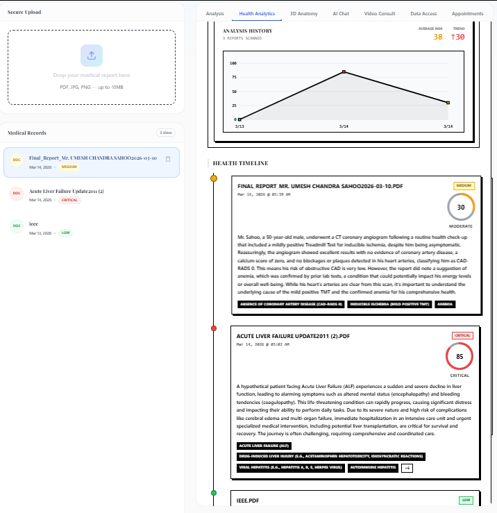

The **Health Analytics** tab gives patients a longitudinal view of their health trends across all uploaded reports.

#### Risk Trends Chart

| Element | Description |
|---------|-------------|
| **Analysis History** | Shows total reports scanned (e.g. `3 REPORTS SCANNED`) with aggregated risk metrics |
| **Average Risk** | Displays the mean risk score across all uploaded reports (e.g. `85`) |
| **Trend** | Shows the latest risk score trend value (e.g. `110`) in red, indicating an upward/worsening trend |
| **Line Chart** | A time-series graph plotting risk scores over dates — helps patients visualize whether their health is improving or deteriorating over time |

#### Health Timeline

A chronological, card-based list of all past reports — most recent first. Each card shows:

| Element | Description |
|---------|-------------|
| **Report Name** | Original uploaded filename (e.g. `LABREPORT3.PDF`, `LABREPORT.PDF`) |
| **Date & Time** | Exact timestamp of the upload (e.g. `Feb 22, 2026 @ 06:16 AM`) |
| **Priority Badge** | Color-coded urgency label — `HIGH` (orange) or `CRITICAL` (red) based on AI risk score |
| **Risk Score Circle** | Circular gauge showing the score (e.g. `90 CRITICAL`, `85`) for quick severity reading |
| **AI Summary** | Plain-English paragraph summarizing detected conditions — e.g. cardiac history with LVEF 24%, insulin-dependent diabetes, triple vessel coronary artery disease |
| **Condition Tags** | Pill-shaped tags for each detected condition (e.g. `INSULIN-DEPENDENT DIABETES MELLITUS (IDDM)`, `TRIPLE VESSEL CORONARY ARTERY DISEASE (TVCAD)`, `LEFT VENTRICULAR DYSFUNCTION`, `MYOCARDIAL ISCHEMIA`) |

> This view allows patients and doctors to track health progression over multiple reports — crucial for chronic condition management.

### 🤖 AI Chat Tab

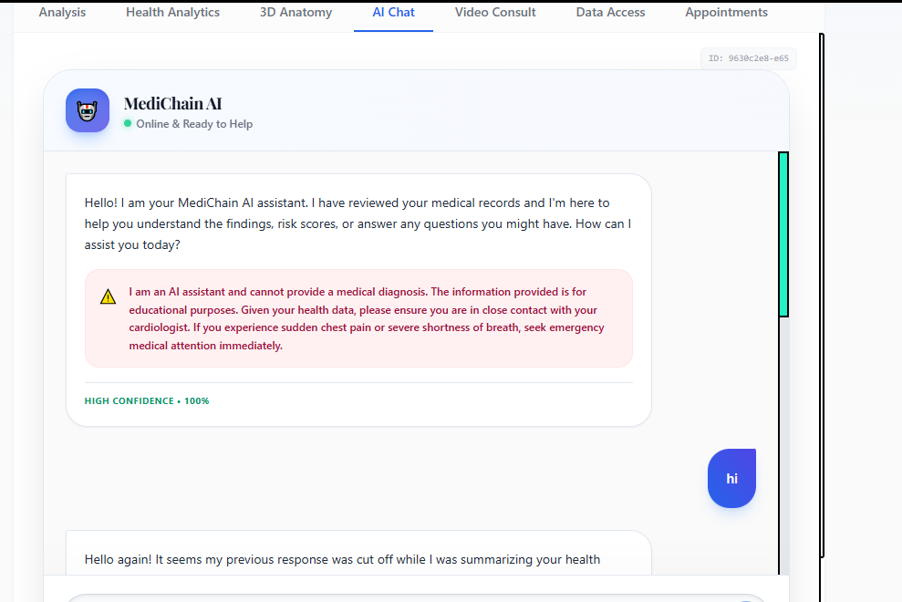

The **AI Chat** tab provides an intelligent, context-aware health assistant directly inside the dashboard. Responses are grounded in the patient's uploaded medical records.

| Element | Description |
|---------|-------------|
| **MediChain AI Header** | Shows the bot name, a pulsing green **Online & Ready to Help** status dot, and a gradient robot avatar icon |
| **Greeting Message** | On open, the AI proactively introduces itself and acknowledges having reviewed the patient's records, ready to explain findings or answer questions |
| **⚠️ Medical Disclaimer Box** | A rose-colored warning block beneath every AI response — reminds users the AI cannot diagnose and advises immediate emergency care for severe symptoms |
| **HIGH CONFIDENCE · 100%** | A confidence score label shown under each AI response to indicate how certain the model is about its answer |
| **Formatted Markdown Output** | AI responses render with **bold text**, numbered lists, bullet points, and section headings — not raw symbols |
| **User Message Bubble** | Patient messages appear as right-aligned gradient blue bubbles |
| **One-Click Appointment Booking** | Typing *"book appointment"* triggers the chatbot to auto-match the patient to the best-fit doctor (e.g. Cardiologist) and present an inline booking widget with date/time pickers |
| **Input Bar** | Full-width pill input at the bottom with a blue send button; supports Enter key to submit |

### 🎥 AI Doctor Video Consult Tab

The **Video Consult** tab connects patients to a real-time AI doctor avatar powered by **Tavus** — a photorealistic AI video technology that generates a live-speaking doctor personalised to the patient's diagnosis.

#### Step 1 — Pre-Join Device Check

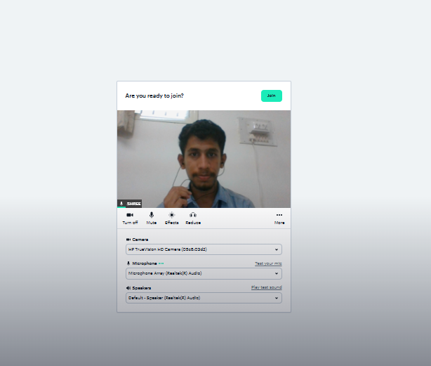

Before the session begins, patients go through a device setup screen:

| Element | Description |
|---------|-------------|
| **"Are you ready to join?" Header** | Confirms the patient is about to enter a live AI video consultation |
| **Join Button** | Teal button that initiates the Tavus session and connects to the AI avatar |
| **Camera Preview** | Live webcam feed of the patient shown before joining — confirms camera is working |
| **SHREE label** | Patient's name overlaid on the preview tile |
| **Controls bar** | **Turn off / Mute / Effects / Reduce / More** — standard controls available before joining |
| **Camera Dropdown** | Device selector — e.g. `HP TrueVision HD Camera` |
| **Microphone Dropdown** | Input device selector with a **Test your mic** link |
| **Speakers Dropdown** | Output device selector with a **Play test sound** link |

#### Step 2 — Live AI Doctor Avatar Session


Once joined, the patient enters a fullscreen live video call with the AI-generated doctor avatar:

| Element | Description |
|---------|-------------|
| **🔴 LIVE · 00:00** | Top-left live session indicator with a real-time duration counter |
| **2 people in call** | Confirms both the patient and the AI avatar are connected |
| **AI Doctor Avatar (main feed)** | A photorealistic Tavus-generated doctor speaking live — explaining the patient's diagnosis, conditions, and recommendations. Scripted dynamically from the AI analysis of the uploaded report |
| **AI Specialist label** | Bottom-left name card — `AI Specialist` · `Cardiologist (Nuclear Cardiology)` — specialist role auto-assigned from the AI report recommendation |
| **SHREE (You) — Pip** | Top-right picture-in-picture of the patient's own webcam feed |
| **Layout toggle** | Bottom-right grid icon to switch between speaker and gallery view |
| **End Call (✕)** | Red button to terminate the session |

> Every consultation is uniquely personalised — the Tavus avatar is scripted in real time using the patient's AI-generated summary, risk score, detected conditions, and recommended specialist.


### 🦴 3D Anatomy Tab — Neural Body Scanner

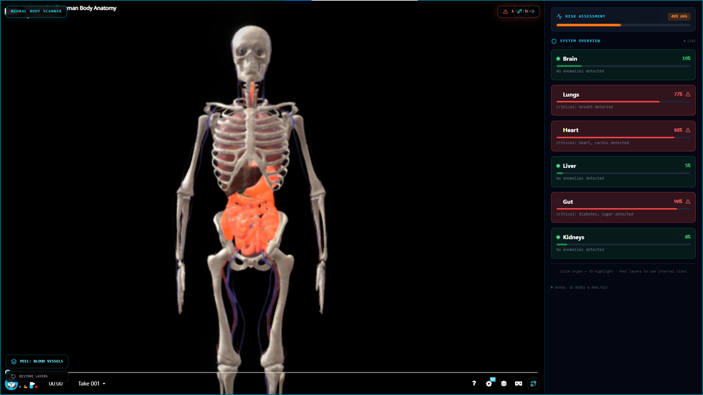

The **3D Anatomy** tab renders an interactive full-body anatomical viewer powered by the AI analysis of the patient's report. It uses a sci-fi "Neural Body Scanner" interface to make health data visually intuitive.

#### Overview View

| Element | Description |
|---------|-------------|
| **NEURAL BODY SCANNER** badge | Top-left branding label for the 3D viewer mode |
| **Alert counter** (top-right) | Red badge showing `⚠ 3 CRITICAL` — the total count of organs flagged as critical by AI |
| **3D Skeleton + Organs** | A full-body anatomical model with highlighted organs — critical organs glow in **orange/red** based on risk severity. Blood vessels, gut, and heart are visibly highlighted in this view |
| **PEEL: BLOOD VESSELS** button | Bottom-left layer toggle — peel away the skin/muscle layer to reveal internal vasculature and organ placement |
| **RESTORE LAYERS** | Resets the model back to its default layered view |

#### System Overview Panel (Right Sidebar)

Live per-organ risk assessment derived from AI report analysis:

| Organ | Risk % | Status |
|-------|--------|--------|
| **Brain** | 19% 🟢 | No anomalies detected |
| **Lungs** | 77% 🔴 | Critical: breath detected |
| **Heart** | 88% 🔴 | Critical: heart, cardio detected |
| **Liver** | 5% 🟢 | No anomalies detected |
| **Gut** | 96% 🔴 | Critical: diabetes, sugar detected |
| **Kidneys** | 8% 🟢 | No anomalies detected |

> The sidebar updates live based on the AI analysis of the uploaded report. Critical organs are highlighted in red both in the sidebar and on the 3D model.

---

#### Organ Detail View (Click-to-Inspect)

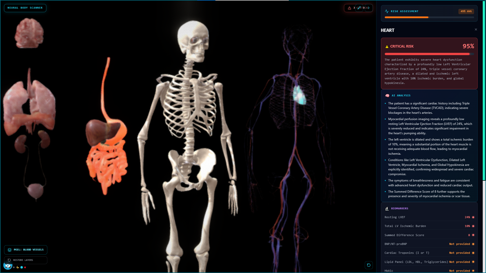

Clicking any organ on the 3D model (or in the sidebar) opens a detailed right-side panel. The exploded view also separates individual organs on the left for anatomical clarity.

**Example — Heart selected (`CRITICAL RISK · 95%`):**

| Section | Content |
|---------|---------|
| **CRITICAL RISK badge** | Red badge with `95%` risk — immediately communicates severity |
| **Clinical Description** | *"The patient exhibits severe heart dysfunction characterized by a profoundly low Left Ventricular Ejection Fraction of 24%, triple vessel coronary artery disease, a dilated and ischemic left ventricle with 10% ischemic burden, and global hypokinesia."* |
| **AI ANALYSIS bullets** | Step-by-step AI findings for this specific organ: TVCAD diagnosis, LVEF of 24%, dilated left ventricle, ischemic burden of 10%, breathlessness consistent with cardiac output reduction, Summed Difference Score of 8 |
| **BIOMARKERS panel** | Key cardiac biomarkers extracted from the report: `Resting LVEF: 24%`, `Total LV Ischemic Burden: 10%`, `Summed Difference Score: 8`, `BNP/NT-proBNP: Not provided`, `Cardiac Troponins: Not provided`, `Lipid Panel: Not provided`, `HbA1c` |

> The exploded organ view (left side) shows isolated Brain, Lungs, Kidneys, Liver, and Gut — allowing the patient to visually understand which organs are affected without medical training.

### 🔐 Data Access Tab — Blockchain Access Control

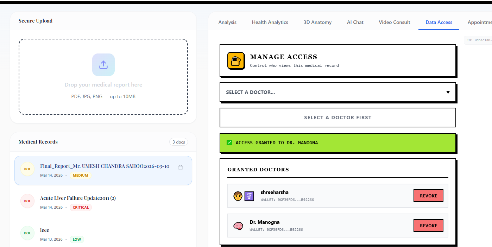

The **Data Access** tab gives patients full, sovereign control over who can view their medical records. Every grant and revocation is executed as an on-chain transaction — no central authority can override it.

| Element | Description |
|---------|-------------|
| **MANAGE ACCESS header** | Orange lock icon with the title *"MANAGE ACCESS — Control who views this medical record"* — clearly communicates the purpose of the tab |
| **SELECT A DOCTOR… Dropdown** | Dropdown listing all registered doctors on the platform — patient picks who to grant access to |
| **SELECT A DOCTOR FIRST button** | Disabled action button that activates once a doctor is selected — triggers a blockchain `grantAccess()` transaction via MetaMask |
| **✅ ACCESS GRANTED TO M V DEEPAK** | Bright green confirmation banner — appears immediately after a successful on-chain grant transaction confirming the doctor now has access |
| **GRANTED DOCTORS panel** | Lists all doctors who currently have active access to this record |
| **Doctor entry — M V Deepak** | Shows the doctor's name and truncated wallet address (`0XFABB0A...51694A`) for on-chain identity verification |
| **REVOKE button** | Red button next to each granted doctor — triggers a `revokeAccess()` blockchain transaction to instantly remove that doctor's access |

> All access control is enforced on-chain via the `MediChainRecords.sol` smart contract — records are cryptographically inaccessible to any doctor not explicitly granted access by the patient.

### 📅 Book Appointment — 3-Step Booking Flow

Patients can book specialist appointments directly from the platform via a clean 3-step wizard at `/patient/book`.

---

#### Step 1 — Select a Doctor

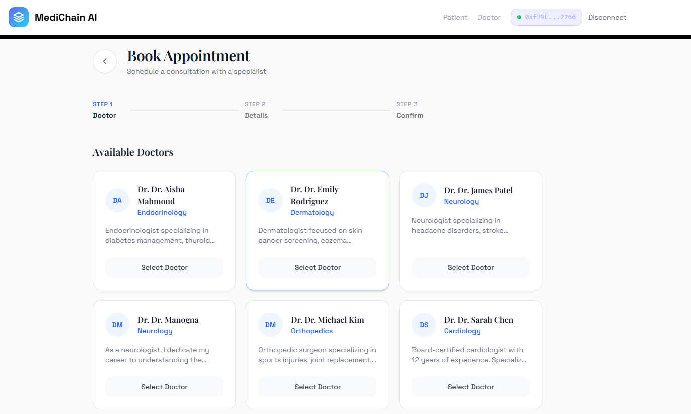

A full-page grid of all registered specialist doctors, filterable by specialty:

| Element | Description |
|---------|-------------|
| **"Book Appointment" header** | Title with subtitle *"Schedule a consultation with a specialist"* and a back arrow to return to the dashboard |
| **Progress stepper** | Top bar showing `STEP 1: Doctor → STEP 2: Details → STEP 3: Confirm` — current step highlighted in blue |
| **"Available Doctors" grid** | Responsive 3-column card grid listing all doctors registered on the platform |
| **Doctor card** | Each card shows the doctor's **avatar initials**, **full name**, **specialty** (linked in blue), a short **bio excerpt**, and a **Select Doctor** button |
| **Selected state** | The chosen card gets a blue border highlight (e.g. `Dr. Emily Rodriguez — Dermatology` shown selected) |

**Doctors visible in this view:**
| Doctor | Specialty | Bio |
|--------|-----------|-----|
| Dr. Aisha Mahmound | Endocrinology | Diabetes management, thyroid… |
| Dr. Emily Rodriguez | Dermatology | Skin cancer screening, eczema… |
| Dr. James Patel | Neurology | Headache disorders, stroke… |
| Dr. Manogna | Neurology | Dedicated neurologist |
| Dr. Michael Kim | Orthopedics | Sports injuries, joint replacement… |
| Dr. Sarah Chen | Cardiology | Board-certified cardiologist, 12 years experience |

---

#### Step 2 — Choose Date, Time & Notes

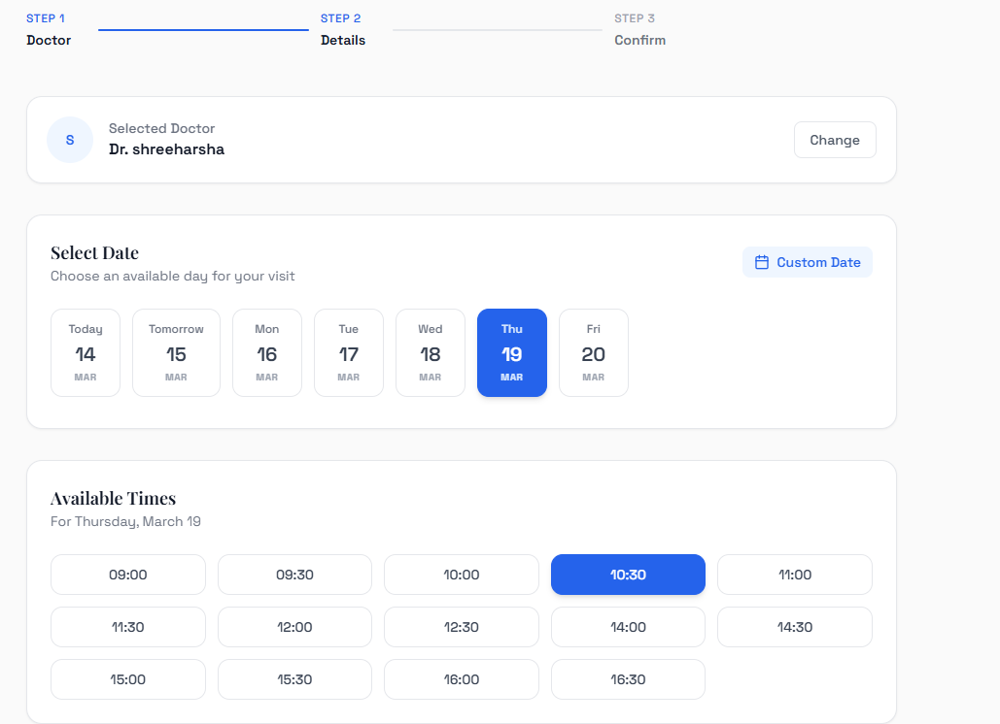

After selecting a doctor, the patient picks a date and time slot:

| Element | Description |
|---------|-------------|
| **Selected Doctor panel** | Top card confirms the chosen doctor (e.g. `Dr. shreeharsha`) with a **Change** button to go back |
| **Select Date strip** | Horizontally scrollable date picker starting from today — selected date highlighted in solid blue (e.g. `Tomorrow · 23 FEB`) |
| **Custom Date button** | Calendar icon button to pick a date beyond the visible strip |
| **Available Times grid** | Grid of time slots for the chosen date (e.g. `09:00`, `09:30`, `10:00`…`16:30`); selected slot shown in blue (e.g. `10:00`) |
| **Additional Notes field** | Optional free-text box for the patient to describe symptoms (e.g. *"I have headache"*) |
| **Confirm Appointment button** | Full-width blue CTA that submits the booking and advances to Step 3 |

---

#### Step 3 — Confirmation

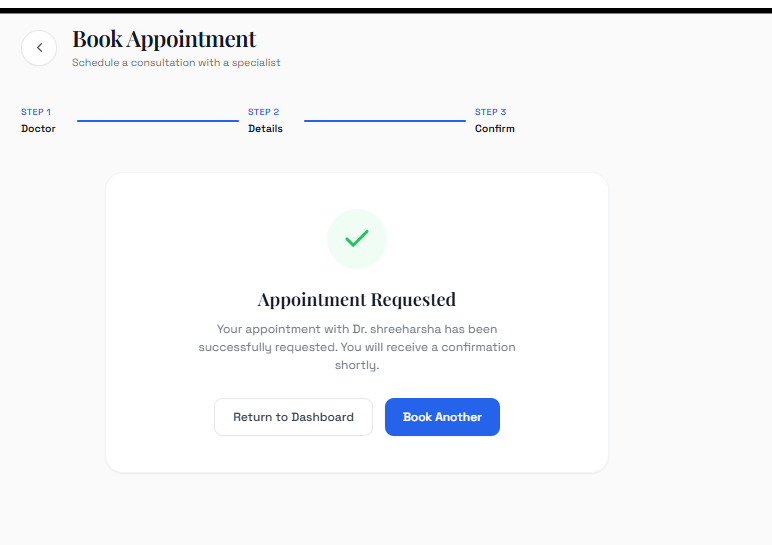

Once confirmed, the wizard shows a success screen:

| Element | Description |
|---------|-------------|
| **Progress stepper** | All 3 steps now fully highlighted — `Doctor → Details → Confirm` all in blue, indicating completion |
| **✅ Green checkmark** | Large animated green circle with a checkmark — immediate visual confirmation |
| **"Appointment Requested" heading** | Bold success title |
| **Confirmation message** | *"Your appointment with Dr. shreeharsha has been successfully requested. You will receive a confirmation shortly."* |
| **Return to Dashboard** | Outlined button to go back to the patient dashboard |
| **Book Another** | Blue button to immediately start a new appointment booking |

---

## 👨‍⚕️ Doctor Dashboard

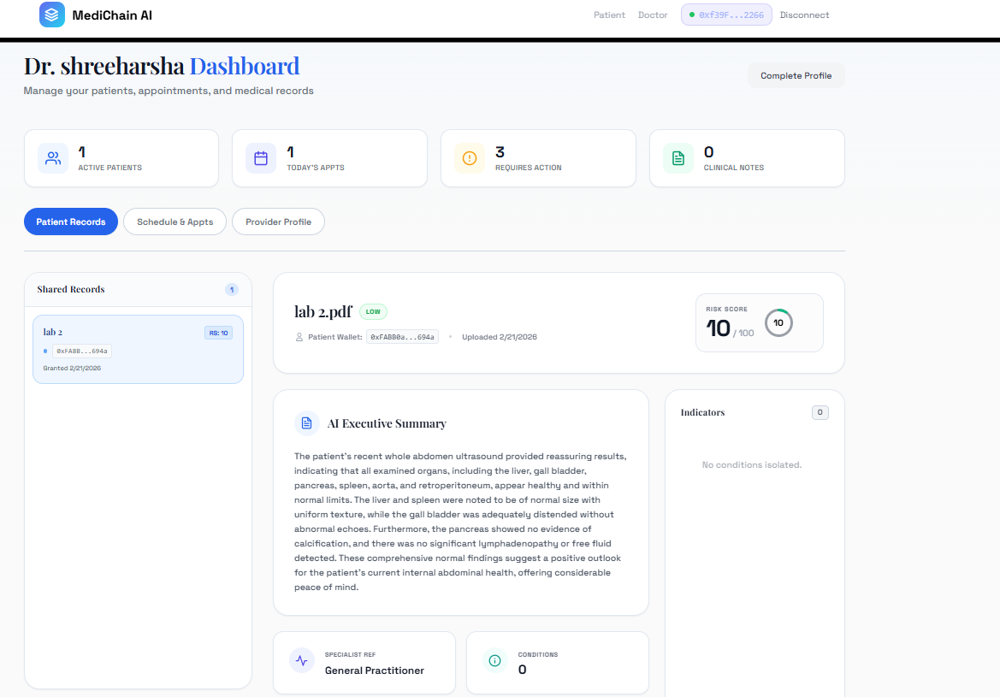

The Doctor Dashboard gives verified doctors a clean, clinical view of all patient records explicitly shared with them via on-chain access grants.

### Header

| Element | Description |
|---------|-------------|
| **"Dr. shreeharsha Dashboard"** | Personalized heading with the doctor's name — *"Manage your patients, appointments, and medical records"* |
| **Complete Profile button** | Top-right CTA to fill in specialty, bio, and contact details shown to patients during booking |
| **Wallet pill** | Connected wallet indicator (`0xf39F...2266`) with a **Disconnect** button |

### Stats Bar

Four at-a-glance metric cards across the top:

| Metric | Value shown | Description |
|--------|-------------|-------------|
| **Active Patients** | `1` | Patients who have granted this doctor record access |
| **Today's Appts** | `1` | Appointments scheduled for today |
| **Requires Action** | `3` ⚠️ | Records or items flagging attention (shown in amber) |
| **Clinical Notes** | `0` | Doctor-authored notes on patient records |

### Tab Navigation

| Tab | Description |
|-----|-------------|
| **Patient Records** *(active)* | View all shared patient records and their AI analysis |
| **Schedule & Appts** | Manage appointment schedule and view bookings |
| **Provider Profile** | Edit the doctor's public profile visible to patients |

### Shared Records Sidebar (Left)

| Element | Description |
|---------|-------------|
| **"Shared Records" panel** | Lists every record the patient has granted access to, with a blue count badge (`1`) |
| **Record entry — `lab 2`** | Shows the filename, risk score badge `RS: 10`, the patient's truncated wallet (`0xFABB...694a`), and grant date (`Granted 2/21/2026`) |
| **Selected state** | The active record is highlighted with a blue background in the sidebar |

### AI Analysis Panel (Right)

Clicking a record loads the full AI analysis on the right:

| Element | Description |
|---------|-------------|
| **Report header** | Filename `lab 2.pdf` with a `LOW` green urgency badge, patient wallet (`0xFABB0a...694a`), and upload timestamp (`Uploaded 2/21/2026`) |
| **Risk Score gauge** | Circular gauge showing `10 / 100` — green, indicating low risk |
| **AI Executive Summary** | Full AI-generated paragraph in plain English: *"The patient's recent whole abdomen ultrasound provided reassuring results, indicating all examined organs — liver, gall bladder, pancreas, spleen, aorta — appear healthy and within normal limits…"* |
| **Indicators panel** | Right-side card showing extracted clinical indicators — `No conditions isolated` for this low-risk report |
| **Specialist Ref** | `General Practitioner` — AI-recommended referral based on the report |
| **Conditions** | `0` — no flagged conditions for this report |


### Schedule & Appts Tab — Doctor Appointment Management

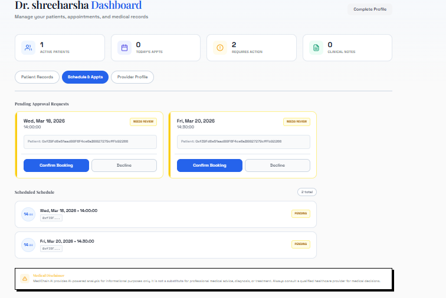

The **Schedule & Appts** tab gives doctors a full view of incoming booking requests and their confirmed schedule. This is where doctors approve or decline patient-booked appointments.

#### Pending Approval Requests

Cards shown for every appointment awaiting doctor confirmation, with a `NEEDS REVIEW` amber badge:

| Element | Description |
|---------|-------------|
| **`NEEDS REVIEW` badge** | Amber pill label — indicates the doctor has not yet responded to this booking request |
| **Date & Time** | Appointment date and requested time (e.g. `Sun, Feb 22, 2026 · 09:00:00`) |
| **Patient wallet** | Full patient wallet address for identity verification (e.g. `0xf39Fd6e51aad88F6F4ce6aB8827279cfffb92266`) |
| **Reason** | Optional note from the patient — e.g. *"I have headache"* (shown on the third pending card) |
| **Confirm Booking** | Blue CTA — marks the appointment as confirmed and notifies the patient |
| **Decline** | Outlined button — rejects the appointment request |

**Pending requests visible:**
| # | Date | Time | Status |
|---|------|------|--------|
| 1 | Sun, Feb 22, 2026 | 09:00 | NEEDS REVIEW |
| 2 | Mon, Feb 23, 2026 | 12:00 | NEEDS REVIEW |
| 3 | Mon, Feb 23, 2026 | 10:00 | NEEDS REVIEW (Reason: *"I have headache"*) |

#### Scheduled Schedule

A chronological timeline of all appointments (confirmed + pending) — `3 total` shown:

| Element | Description |
|---------|-------------|
| **Time circle avatar** | Circular badge showing the appointment hour (e.g. `09 HH`, `12 HH`, `10 HH`) for quick scanning |
| **Date & Time** | Full datetime of each appointment (e.g. `Sun, Feb 22, 2026 • 09:00:00`) |
| **Patient wallet** | Truncated wallet address (e.g. `0xf39F...`) |
| **Reason snippet** | Patient's note shown inline where provided (e.g. `I have headache`) |
| **`PENDING` badge** | Amber status badge — all 3 appointments still pending doctor confirmation |

#### Medical Disclaimer Footer

> ⚠️ *"MediChain AI provides AI-powered analysis for informational purposes only. It is not a substitute for professional medical advice, diagnosis, or treatment. Always consult a qualified healthcare provider for medical decisions."*

### Provider Profile Tab

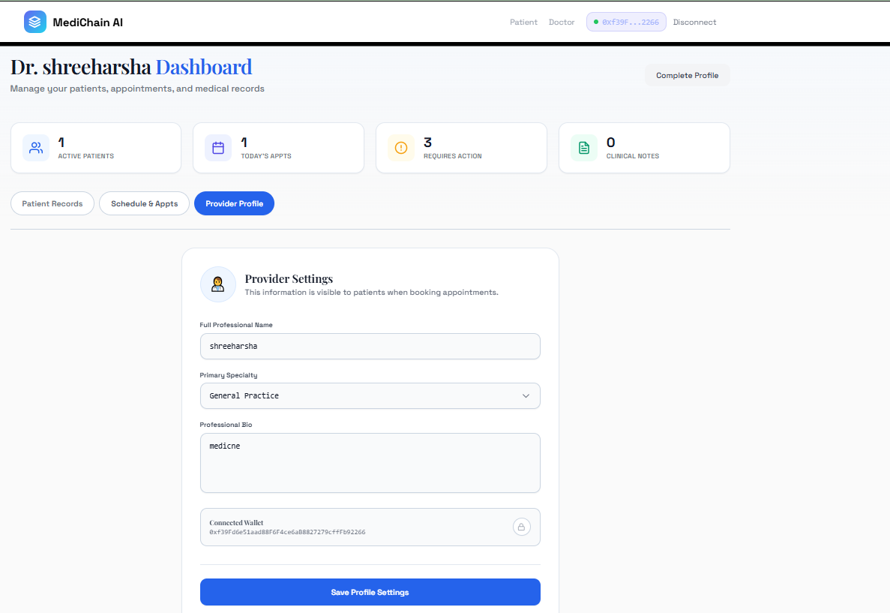

The **Provider Profile** tab lets doctors set up their public-facing profile — information that patients see when browsing or booking appointments.

| Element | Description |
|---------|-------------|
| **Provider Settings header** | Doctor avatar icon with the title *"Provider Settings"* and subtitle *"This information is visible to patients when booking appointments."* |
| **Full Professional Name** | Text input pre-filled with the doctor's name (e.g. `shreeharsha`) |
| **Primary Specialty** | Dropdown selector for specialty (e.g. `General Practice`) — the chosen specialty is what appears on the doctor's card in the patient booking grid |
| **Professional Bio** | Free-text area for a short professional description (e.g. `medicine`) — shown as the bio excerpt on doctor cards |
| **Connected Wallet** | Read-only field displaying the doctor's full MetaMask wallet address (`0xf39Fd6e51aad88F6F4ce6aB8827279cfffb92266`) with a lock icon — non-editable, tied to on-chain identity |
| **Save Profile Settings** | Full-width blue button that persists all changes to the InsForge database |

> Profile data is stored off-chain in InsForge but the wallet address is the canonical on-chain identity — patients grant record access to this wallet via smart contract.

---

## 🏗️ Architecture
| Layer | Tech |
|-------|------|
| **Frontend** | Next.js 15, TypeScript, TailwindCSS, ethers.js |
| **Backend** | InsForge (PostgreSQL, Storage, AI, Edge Functions) |
| **Blockchain** | Solidity, Hardhat, MetaMask |
| **AI Services** | InsForge AI (Claude), Tavus Avatar API |

### System Flow

```
Patient (MetaMask) ──► Upload Report ──► InsForge Storage
                                              │
                                    analyze-report (Edge Fn)
                                    AI extracts text + analysis
                                              │
                              SHA-256 hash ──► Blockchain (Solidity)
                                              │
                          Patient views analysis, chats with AI,
                          watches AI doctor video, manages access
                                              │
                          Doctor (granted access) ──► Views records
```

---

## 🚀 Quick Start

### 1. Frontend

```bash
cd frontend
npm install
npm run dev        # → http://localhost:3000
```

### 2. Blockchain (optional, for on-chain features)

```bash
cd blockchain
npm install
npx hardhat node                                          # Terminal 1
npx hardhat run scripts/deploy.ts --network localhost     # Terminal 2
```

Copy the deployed contract address to `frontend/.env`:
```
NEXT_PUBLIC_CONTRACT_ADDRESS=0xYourDeployedAddress
```

### 3. Environment Variables

**`frontend/.env`**:
```
NEXT_PUBLIC_INSFORGE_BASE_URL=https://afhtz3nj.us-west.insforge.app
NEXT_PUBLIC_INSFORGE_ANON_KEY=<your-anon-key>
NEXT_PUBLIC_CONTRACT_ADDRESS=<deployed-contract-address>
```

**InsForge Edge Function environment** (set in InsForge dashboard):
```
TAVUS_API_KEY=<your-tavus-api-key>
TAVUS_REPLICA_ID=<your-tavus-replica-id>
```

---

## 📁 Project Structure

```
medicare-hackaleague/
├── blockchain/                     # Smart contract
│   ├── contracts/MediChainRecords.sol
│   ├── scripts/deploy.ts
│   └── hardhat.config.ts
├── frontend/                       # Next.js App Router
│   └── src/
│       └── app/
│           ├── page.tsx            # Landing page (role selector)
│           ├── patient/
│           │   ├── page.tsx        # Patient dashboard (all tabs)
│           │   ├── book/page.tsx   # Appointment booking
│           │   └── components/
│           │       ├── AnalysisView.tsx
│           │       ├── AppointmentsView.tsx
│           │       └── AccessManager.tsx
│           └── doctor/
│               └── page.tsx        # Doctor dashboard
├── functions/                      # InsForge Edge Functions
│   ├── analyze-report.js           # AI report analysis
│   ├── medical-chatbot.js          # AI chat backend
│   └── tavus-video.js              # AI doctor video generation
└── screenshots/                    # Website screenshots (for README)
```

---

## 🧠 InsForge Backend

- **Database tables**: `users`, `analyses`, `chat_history`, `access_grants`, `appointments`
- **Storage**: `medical-reports` bucket (private, patient-scoped)
- **Edge Functions**: `analyze-report`, `medical-chatbot`, `tavus-video`

---

## ⛓️ Smart Contract (`MediChainRecords.sol`)

| Function | Description |
|----------|-------------|
| `registerPatient()` | Register the caller as a patient |
| `registerDoctor()` | Register the caller as a doctor |
| `storeRecord(hash)` | Store SHA-256 hash of a medical report on-chain |
| `grantAccess(doctor)` | Allow a doctor address to view patient records |
| `revokeAccess(doctor)` | Remove a doctor's access |
| `emergencyAccess(...)` | Log emergency access event for auditing |

---

## 🔒 Privacy & Security

- **Zero-Knowledge Encryption Pipeline**: Encryption keys are manually entered and locally managed by the patient. Keys are never stored in the database or sent to the backend, ensuring absolute data privacy.
- **Local PDF Processing**: Text extraction from uploaded PDF files is handled securely in the browser using `pdfjs-dist`, preventing sensitive raw files from unnecessary transit.
- **Private Storage**: Medical reports are powerfully encrypted and stored securely in InsForge storage — only accessible to the authenticated patient.
- **On-chain Access Control**: No doctor can read records without the patient's explicit blockchain transaction.
- **Cryptographic Verification**: SHA-256 hashes stored on-chain ensure report integrity (tamper-proof verification).
- **Edge Analytics**: AI analysis leverages secure Edge Functions — raw data isn't exposed to third-party databases.

---


## 🔧 Requestly Integration — API Testing & Automation Suite

MediChain AI ships with a **production-grade Requestly API collection** covering all 28+ backend endpoints. This enables automated API testing, sequential workflow validation, and real-time debugging — all through Requestly's API Client and Collection Runner.

### 📦 What's Included

| File | Purpose |
|------|---------|
| `backend/medichain-openapi.json` | Full OpenAPI v3.0.2 specification — natively importable into Requestly |
| `/docs` (FastAPI) | Auto-generated Swagger documentation during development |

### 🚀 Quick Setup

1. **Install Requestly** — Download from [requestly.com](https://requestly.com) (free tier works)
2. **Import the Collection** 
   - Open Requestly Desktop → Select **APIs** on the sidebar
   - Click **Import** → Choose **OpenAPI**
   - Upload `backend/medichain-openapi.json`
3. **Set Up Environments**
   - Select the "Environments" tab and create a new environment named `MediChain Local`
   - Add these essential variables:
     - `baseUrl`: `http://localhost:8000`
     - `testPatientWallet`: `0xTestPatient1234567890abcdef1234567890abcd`
     - `testDoctorWallet`: `0xTestDoctor1234567890abcdef1234567890abcde`
4. **Start the backend** — `cd backend && uvicorn main:app --reload`
5. **Run** — Execute individual requests or use the **Collection Runner** for full automated testing

### 🧪 Test Collection Structure

```
🏥 Infrastructure          →  Health Check
🧠 AI Analysis             →  Analyze Report, Chat, Organ Analysis
🎥 Tavus AI Doctor         →  Video Generation, Status Poll, CVI Conversation
📋 Medical Records         →  Get/Update/Clone/Delete Records, Cache Check
🔐 Access Control (RBAC)   →  Grant/Get/Revoke Access
📅 Appointments            →  Create/Get/Cancel Appointments, Slot Check
👨‍⚕️ Doctor Dashboard        →  Profiles, Grants, Appointments, Notes
🧹 Test Cleanup            →  Delete test data
```

### 🔗 Chained Test Variables (Sequential Execution)

The collection uses **chained environment variables** — outputs from early requests auto-populate inputs for later ones:

```
Analyze Report → stores testAnalysisId, testRecordId
    ↓
Get Records, Update Record, Clone Record → use testRecordId
    ↓
Grant Access, Get Grants, Revoke Access → use testAnalysisId
    ↓
Create Appointment → stores testAppointmentId
    ↓
Cancel Appointment, Update Status → use testAppointmentId
    ↓
Delete Record (Cleanup) → uses testRecordId
```

### ✅ Test Coverage

Every endpoint includes post-response validation scripts that check:
- **Status codes** (200 expected for all success paths)
- **Response schema** (field types, required fields, enum values)
- **Data integrity** (risk scores in 0–100 range, urgency levels match enum, hash format correct)
- **Business logic** (cache deduplication, access grant/revoke lifecycle, appointment state machine)

### 🔄 OpenAPI Import (Alternative)

FastAPI auto-generates an OpenAPI spec at `http://localhost:8000/openapi.json`. Import this directly into Requestly for auto-generated request stubs:

```
Requestly → APIs → Import → OpenAPI → paste http://localhost:8000/openapi.json
```

### 💡 Creative Use Cases (Partner Track)

| Use Case | How Requestly Helps |
|----------|---------------------|
| **Mocking Blockchain RPC** | Use Requestly's response override to mock MetaMask/Hardhat responses — test frontend without running a local chain |
| **Chaos Engineering** | Inject 500/429 errors into AI endpoints to validate retry logic and graceful degradation |
| **OAuth Token Injection** | Override auth headers to test doctor-patient access control flows without real MetaMask signing |
| **API Response Stubbing** | Mock Gemini/Tavus API responses locally — enables offline demo mode for hackathon presentations |
| **Sequential Workflow Testing** | Collection Runner validates the full patient journey: register → upload → analyze → chat → book → grant → revoke |

---

> **Built for HackaLeague** — *Decentralized. Intelligent. Patient-first.*

